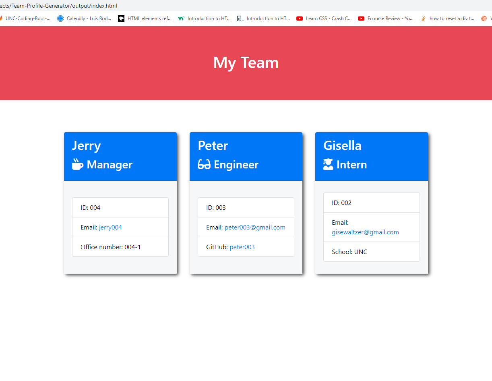

# Team Profile Generator

## My Task as a developer

My task is to build a Node.js command-line application. It will take information about employees engineering team, then generates an HTML webpage that displays a breef description of each person. In order to maintain the code working properly we are going to TEST `Employee`, `Manager`, `Engineer`, and `Intern`. The tests for these will be in the `_tests_`). 

I am providing (on the link below) a walk-through video since this application is not going to be deployed. This walk through video is going to show all the testing and make sure it passes the ttest and it's functionality to the final product.

[Walk-through link](https://www.youtube.com/watch?v=OuBmslkA-uA)

## User 

```md
AS A manager
I WANT to generate a webpage that displays my team's basic info
SO THAT I have quick access to their emails and GitHub profiles
```

## Requirements

```md
GIVEN a command-line application that accepts user input
WHEN I am prompted for my team members and their information
THEN an HTML file is generated that displays a nicely formatted team roster based on user input
WHEN I click on an email address in the HTML
THEN my default email program opens and populates the TO field of the email with the address
WHEN I click on the GitHub username
THEN that GitHub profile opens in a new tab
WHEN I start the application
THEN I am prompted to enter the team manager’s name, employee ID, email address, and office number
WHEN I enter the team manager’s name, employee ID, email address, and office number
THEN I am presented with a menu with the option to add an engineer or an intern or to finish building my team
WHEN I select the engineer option
THEN I am prompted to enter the engineer’s name, ID, email, and GitHub username, and I am taken back to the menu
WHEN I select the intern option
THEN I am prompted to enter the intern’s name, ID, email, and school, and I am taken back to the menu
WHEN I decide to finish building my team
THEN I exit the application, and the HTML is generated
```

## Screenshot

The following image shows screenshot of the generated HTML’s appearance and functionality:




## Installation
My application will use [Jest](https://www.npmjs.com/package/jest) to running the unit tests and [Inquirer](https://www.npmjs.com/package/inquirer) for collecting input from the user. 

The directory structure is as follows

```md
__tests__/			// jest tests
  Employee.test.js
  Engineer.test.js
  Intern.test.js
  Manager.test.js
dist/               // rendered output (HTML) and CSS style sheet
lib/				// classes
src/				// template code for  html
index.js			// runs the application
```

 
